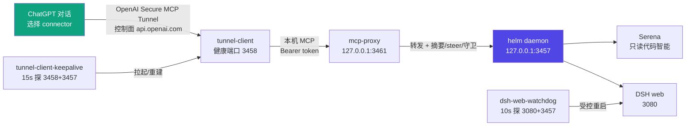

# 架构与端口

## 架构图



## 组件

| 组件 | 说明 | 来源 |
|---|---|---|
| ChatGPT | 推理/审查端（读项目、架构设计、调试、审查） | OpenAI |
| OpenAI Secure MCP Tunnel | 控制面轮询（api.openai.com）+ Cloudflare 隧道转发 MCP | OpenAI Platform 创建 |
| tunnel-client | 隧道客户端（Go 二进制，内置 cloudflared） | OpenAI 提供，`~/.local/bin/tunnel-client` |
| helm daemon | `agent-chatgpt-helm` 核心服务：MCP 服务端 + Serena 桥 + DSH 会话桥 | npm `@beforewave/agent-chatgpt-helm`（由 DSH 插件拉起） |
| dsh-chatgpt-helm 插件 | DSH 插件，web 启动时拉起 helm daemon | npm `@beforewave/dsh-chatgpt-helm`（`dsh plugin --profile web add`） |
| Serena | 代码智能（只读）：read_file / list_dir / find_file / search / symbols | `uv tool install serena-agent` |
| dsh web | DSH 本体，3080；ChatGPT 派发的任务在这里创建原生会话 | deepseek-harness |
| dsh-web-watchdog | web 守护：3080+3457 双探针受控重启 | 本仓库 |
| tunnel-client-keepalive | 隧道守护：3458+3457 双探针自动拉起（tunnel 经 mcp-proxy 3461） | 本仓库 |
| mcp-proxy | 升级能力层：tunnel 与 daemon 之间的本地 MCP 代理——sessions_get 默认摘要瘦身、sessions_prompt mode=steer 插队（DSH 宿主 API 3080）、50KB 响应守卫；逻辑与 dsh-helm 同源（vendored @ 3c3219d） | 本仓库（`mcp-proxy/`，Node 原生零依赖） |

## 端口

| 端口 | 服务 | 认证 |
|---|---|---|
| 3080 | DSH web UI（loopback） | 登录态 |
| 3457 | helm daemon MCP（`/mcp` + `/healthz`） | `/healthz` 免认证；`/mcp` 需 `Authorization: Bearer <token>`（`~/.agent-chatgpt-helm/token`，daemon 自动生成） |
| 3458 | tunnel-client 健康端口（`/healthz`） | 免认证 |
| 3461 | mcp-proxy MCP 入口（`/mcp` + `/healthz`，tunnel 的 server-url 目标） | `/healthz` 免认证；`/mcp` 转发 daemon Bearer token |

## 数据流

ChatGPT 经隧道发出的 MCP 调用先到 mcp-proxy（3461）：`sessions_get` 默认返回结构化摘要（~KB，缓存 60s）；`sessions_prompt` 带 `mode=steer` 时经 DSH 宿主 API（3080）立即注入运行中回合；所有 `tools/call` 响应超 50KB 统一截断（合法 JSON + `truncated` 元数据）。其余工具原样转发 daemon（3457）。

```
ChatGPT 对话
  → connector（平台侧，指向 tunnel_id）
  → 控制面长轮询（tunnel-client 通过 127.0.0.1:7897 代理访问 api.openai.com）
  → Cloudflare 隧道反向连回本机 tunnel-client
  → tunnel-client POST http://127.0.0.1:3457/mcp（带 AGENT_CHATGPT_HELM_AUTH）
  → helm daemon：
      code_*  → Serena（只读代码智能，需先 code_use_workspace 激活）
      sessions_* → dsh web（原生 DSH 会话，可在 3080 接管）
```

## 隧道所有权

`agent-chatgpt-helm` 默认自带 tunnel 管理（daemon 直接 spawn tunnel-client）。**本套件禁用该内置管理**（patch `tunnelEnabled: false`），原因：

1. daemon 自管隧道与 keepalive 同时运行时，两个实例轮询同一 tunnel_id，互相 pkill → 隧道抖动（502/断连）；
2. daemon 由 web 拉起，web 重启后 daemon 会重启，自管隧道也随之重启 → MCP session 失效；
3. keepalive 独占管理，检测 daemon PID 变化后主动重建隧道，行为可预测、可日志审计。

## 守护逻辑

### dsh-web-watchdog（v2）

- 每 10s：`3080 监听 && is_dsh && web_healthy` → ui_ok；`3457/healthz` → mcp_ok
- **双失败 ≥3 次**才 `restart_web`（SIGTERM → 15s → SIGKILL → 清残留 daemon → 删陈旧 sock → 带 env 拉起 → 双就绪验证）
- 仅 UI 挂（MCP 通）→ 只告警不杀（保护活跃工具调用）
- 仅 MCP 挂（UI 通）→ 重启 web 连带重启 daemon
- 单实例：PID 锁 + 命令行校验

### tunnel-client-keepalive（v2）

- 每 15s：探 3458/healthz + 3457/healthz + 比对 daemon PID
- daemon PID 变化 → 重启隧道（MCP session 失效必须重建）
- 隧道挂 → 重启
- 3457 挂但隧道活 → 不杀隧道（daemon 恢复自动转发）
- 单实例：PID 锁 + 命令行校验
- 凭据注入：从 `~/.dsh/.credentials.yaml` 读 CONTROL_PLANE_TUNNEL_ID / CONTROL_PLANE_API_KEY（**env: 语法读进程环境，必须 export**）
- 代理：HTTPS_PROXY=http://127.0.0.1:7897（无代理时 api.openai.com 轮询全部超时 → ChatGPT 侧探测失败）

## 凭据文件

| 文件 | 内容 | 生成方式 |
|---|---|---|
| `~/.dsh/.credentials.yaml` | `CONTROL_PLANE_TUNNEL_ID` + `CONTROL_PLANE_API_KEY` | 手动创建（模板见 config/） |
| `~/.agent-chatgpt-helm/token` | MCP Bearer token（32B base64url，0600） | **daemon 首次启动自动生成**，无需手动 |

## 代理要求

`api.openai.com` 在本机网络环境直连不通（或超时），控制面轮询（`/v1/tunnels/<id>/poll`）全部失败 → ChatGPT 侧连接器探测不到隧道。所有海外请求必须走 `127.0.0.1:7897`。watchdog 与 keepalive 的 launchd 环境均已注入代理；Clash 未开时组件会告警但不会死，恢复后自动连通。
